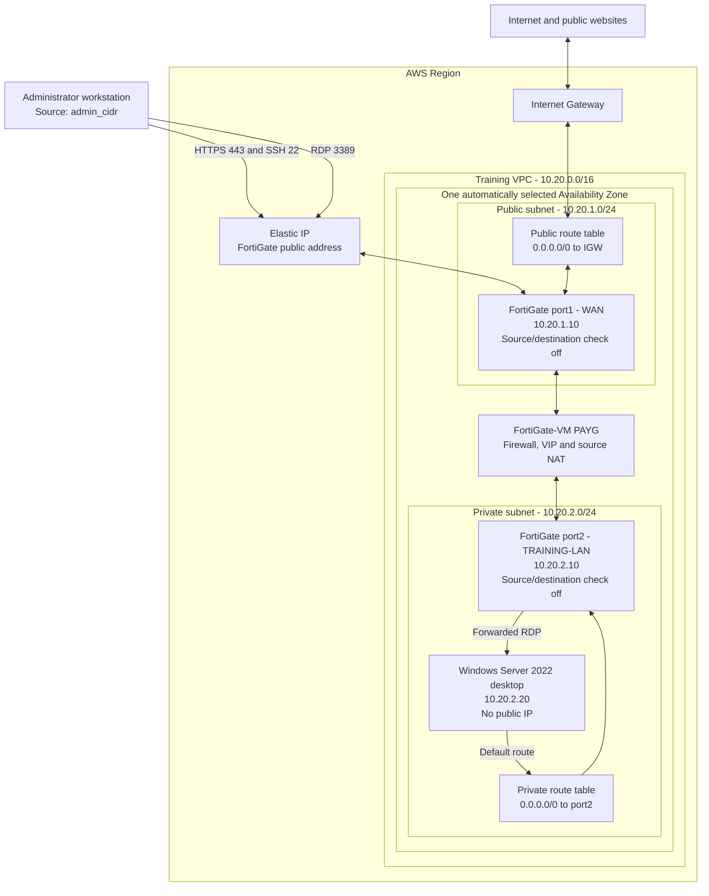

# FortiGate AWS Training Lab

This directory contains a small Terraform training environment in AWS. It
deploys a pay-as-you-go FortiGate-VM and a private Windows desktop whose
internet traffic is routed through the FortiGate.

This is a lab design. It is not intended to be a production reference
architecture.

## Architecture



The diagram shows the logical packet path. The FortiGate has two network
interfaces, and it is the only path between the private Windows subnet and the
internet. There is no NAT gateway and the Windows desktop receives no public
IP address.

### Traffic flows

| Use case | Packet path | Controls and translation |
| --- | --- | --- |
| FortiGate administration | Administrator -> Elastic IP -> `port1` | The FortiGate security group permits HTTPS/443 and SSH/22 only from `admin_cidr`. |
| Windows Remote Desktop | Administrator -> Elastic IP -> `port1` -> FortiGate VIP -> `port2` -> Windows | AWS permits TCP/3389 only from `admin_cidr`; FortiGate destination NAT forwards it to `10.20.2.20:3389`. |
| Windows web browsing | Windows -> private route table -> `port2` -> FortiGate -> `port1` -> internet gateway -> website | The private default route points to `port2`; the FortiGate outbound policy permits the traffic and applies source NAT. |
| Return traffic | Internet -> internet gateway -> `port1` -> FortiGate -> `port2` -> Windows | FortiGate state tracking sends reply traffic back through the session that initiated or accepted it. |

### Addressing and boundaries

- `port1` is attached to the public subnet `10.20.1.0/24`.
- `port2` is attached to the private subnet `10.20.2.0/24`.
- Both subnets are created in the same automatically selected Availability Zone
  because EC2 cannot attach ENIs from different zones to one instance.
- The private subnet sends its default route to FortiGate `port2`.
- The public subnet sends its default route to the internet gateway.
- The Windows desktop has no public IP address.
- FortiGate performs source NAT for Windows internet access.
- TCP/3389 on the FortiGate Elastic IP is forwarded to the Windows desktop.
- Source/destination checking is disabled on both FortiGate interfaces so the
  appliance can route traffic that is not addressed to the appliance itself.

## Resources

The configuration in `fortigate-training.tf` creates:

- One VPC with public and private subnets
- One automatically selected Availability Zone containing both subnets
- One internet gateway
- Public and private route tables
- One PAYG FortiGate-VM, defaulting to `c6i.large`
- Two FortiGate network interfaces with source/destination checking disabled
- One Elastic IP for FortiGate management and RDP forwarding
- One Windows Server 2022 Desktop Experience instance, defaulting to `t3.medium`
- One Terraform-generated 4096-bit RSA key and corresponding EC2 key pair
- One local private key file created with `0600` permissions
- Security groups for FortiGate management, FortiGate LAN traffic, and Windows
- Encrypted `gp3` EBS volumes

## Prerequisites

Before deployment, ensure that you have:

1. Terraform 1.6 or later.
2. AWS CLI v2 and a configured AWS CLI profile with permission to create the
   resources listed above. The default profile name used by this project is
   `dev`.
3. Permission to write the generated private key into this directory.
4. An accepted subscription to the
   [Fortinet FortiGate PAYG Marketplace product](https://aws.amazon.com/marketplace/pp/prodview-wory773oau6wq).
5. Your current public IPv4 address in CIDR notation, normally `/32`.

The default region is `ca-central-1`.

## Files

| File | Purpose |
| --- | --- |
| `fortigate-training.tf` | Provider configuration, variables, infrastructure, FortiOS bootstrap configuration, and outputs |
| `README.md` | Deployment and operating instructions |
| `.gitignore` | Prevents state, private keys, plans, and local variables from being committed |
| `terraform.tfvars.example` | Copyable example containing the required and optional variables |

Terraform also creates local state, provider files, and a generated `.pem`
file. Do not commit credentials, private keys, or Terraform state.

## Generated key pair

No pre-existing EC2 key pair is required. During `terraform apply`, Terraform:

- Generates a 4096-bit RSA private key.
- Registers its public key as `${name}-windows` in EC2.
- Writes the private key to `${name}-windows.pem` in this directory.
- Sets the local private key file permissions to `0600`.
- Uses the private key to decrypt the Windows Administrator password.

The private key and decrypted password are stored in Terraform state. The
`sensitive` designation hides them from normal CLI output, but does not encrypt
the state. Protect the state file as carefully as the generated `.pem` file.

## Configure variables

Copy the example variable file:

```bash
cp terraform.tfvars.example terraform.tfvars
```

Edit `terraform.tfvars` and replace the example address:

```hcl
admin_cidr = "203.0.113.10/32"
```

To identify your current public IPv4 address:

```bash
curl -s https://checkip.amazonaws.com
```

Do not set `admin_cidr` to `0.0.0.0/0`. The Terraform validation explicitly
rejects unrestricted IPv4 access.

### Variables

| Variable | Default | Description |
| --- | --- | --- |
| `admin_cidr` | Required | Public IPv4 CIDR allowed to use HTTPS, SSH, and forwarded RDP |
| `aws_profile` | `dev` | AWS CLI profile used by both the `aws` and `awscc` providers |
| `aws_region` | `ca-central-1` | AWS deployment region |
| `instance_type` | `c6i.large` | FortiGate EC2 instance type |
| `windows_instance_type` | `t3.medium` | Windows EC2 instance type |
| `name` | `fortigate-training` | Resource name prefix |

If command-line variables are preferred, pass them to every `plan`, `apply`,
and `destroy` command:

```bash
-var="admin_cidr=$(curl -s https://checkip.amazonaws.com)/32"
```

## Deploy

Authenticate the AWS CLI profile before running Terraform. For an IAM Identity
Center/SSO profile, run:

```bash
aws sso login --profile dev
```

Confirm that the profile returns the expected AWS account and identity:

```bash
aws sts get-caller-identity --profile dev
```

If your profile is not named `dev`, set `aws_profile` in `terraform.tfvars` and
substitute that profile name in the two commands above. Both the HashiCorp AWS
provider and AWS Cloud Control provider use this same variable.

Initialize the directory:

```bash
terraform init
```

Format and validate the configuration:

```bash
terraform fmt -check
terraform validate
```

Review the proposed changes carefully:

```bash
terraform plan
```

Deploy the lab:

```bash
terraform apply
```

First boot can take several minutes. Windows password generation can take
approximately 15 minutes after instance launch.

## Access FortiGate

Display the FortiGate URL and initial credentials:

```bash
terraform output -raw fortigate_url
terraform output -raw fortigate_username
terraform output -raw initial_password
```

The initial FortiGate username is `admin`, and its initial password is the EC2
instance ID. Change the password at first login. A browser warning is expected
while FortiGate is using its default self-signed HTTPS certificate.

The AWS security group permits FortiGate HTTPS and SSH only from
`admin_cidr`.

## Access Windows

Display the Remote Desktop address:

```bash
terraform output -raw windows_rdp_address
```

The username is:

```text
Administrator
```

Display the decrypted Windows password:

```bash
terraform output -raw windows_password
```

Display the generated private key path:

```bash
terraform output -raw windows_private_key_file
```

RDP connects to the FortiGate Elastic IP. FortiGate forwards the session to
`10.20.2.20`. The Windows instance is not directly exposed to the internet.

## FortiGate bootstrap configuration

Terraform supplies an initial FortiOS configuration that:

- Labels `port1` as `WAN` and `port2` as `TRAINING-LAN`.
- Enables HTTPS and SSH management on `port1`.
- Creates a Windows desktop address object.
- Creates a source NAT policy from the training LAN to the internet.
- Creates a VIP and firewall policy for RDP access to Windows.

The AWS security group restricts incoming RDP to `admin_cidr`. The corresponding
FortiGate policy uses `srcaddr all` because AWS performs the external source
restriction before traffic reaches FortiGate.

Changing FortiGate `user_data` causes Terraform to replace the FortiGate EC2
instance. Back up manual FortiGate configuration before applying such a change.

## Confirm Windows traffic inspection

After connecting to Windows, browse to an external website and confirm the
session appears in the FortiGate logs. Useful FortiGate CLI checks include:

```text
get router info routing-table all
diagnose sniffer packet any 'host 10.20.2.20' 4 0 l
diagnose sys session filter src 10.20.2.20
diagnose sys session list
```

Additional security profiles, such as web filtering, DNS filtering, application
control, antivirus, or SSL inspection, can be added manually to the
`Training-LAN-to-Internet` policy for exercises.

## Common problems

### AWS credentials or SSO session expired

The `aws` and `awscc` providers authenticate independently, so the selected
profile must be configured for both. This project supplies `aws_profile` to
both provider blocks. Refresh an expired IAM Identity Center/SSO session and
verify it before retrying Terraform:

```bash
aws sso login --profile dev
aws sts get-caller-identity --profile dev
terraform plan
```

If `get-caller-identity` fails, correct the AWS CLI profile or SSO session
before troubleshooting Terraform. If a different profile name is used, update
`aws_profile` in `terraform.tfvars`.

### Network interfaces are in different Availability Zones

EC2 can attach a secondary network interface only when it is in the same
Availability Zone as the instance. AWS automatically selects the public
subnet's zone, and the configuration explicitly creates the private subnet in
that same zone.

If an earlier apply already created the subnets in different zones, rerun:

```bash
terraform plan
terraform apply
```

The plan should replace the incorrectly placed subnet and dependent lab
resources. Because this is a disposable training lab, if the partial deployment
does not converge cleanly, use `terraform destroy` followed by a fresh
`terraform apply`.

### No FortiGate AMI found

Confirm that the FortiGate PAYG Marketplace terms have been accepted in the
same AWS account and that the product is available in the selected region.

### FortiGate fails to launch after changing instance type

The chosen instance type must be supported by the selected FortiGate AMI and
must support at least two network interfaces.

### Windows password is empty

Windows password generation can take approximately 15 minutes. Wait several
more minutes and rerun:

```bash
terraform apply
terraform output -raw windows_password
```

Confirm that `${name}-windows.pem` exists and that the Terraform state has not
been removed or replaced.

### RDP does not connect

Check that:

- Your current public IP still matches `admin_cidr`.
- TCP/3389 is allowed by the FortiGate management security group.
- The `Windows-RDP` VIP and `RDP-to-Windows` policy exist on FortiGate.
- Windows is running and has the private address `10.20.2.20`.

### Windows cannot browse the internet

Check that:

- The private route table sends `0.0.0.0/0` to the FortiGate port2 ENI.
- Source/destination checking is disabled on both FortiGate ENIs.
- The `Training-LAN-to-Internet` policy is enabled and using NAT.
- FortiGate has a valid default route through port1.

## Costs

This lab incurs charges for the FortiGate Marketplace software, FortiGate EC2
compute, Windows EC2 compute, EBS storage, the public IPv4 address, and any
applicable data transfer. PAYG software can be significantly more expensive
than the EC2 instance alone.

Use AWS Cost Explorer or a budget alert, and destroy the lab when it is not
needed. Stopping instances does not remove all associated storage and public
IPv4 charges.

## Destroy

Preview the deletion:

```bash
terraform plan -destroy
```

Remove the lab:

```bash
terraform destroy
```

Terraform deletes the EC2 key pair and generated local `.pem` file during
destroy. Confirm in AWS that no manually created resources remain.

Retain the Terraform state until destruction finishes. Without the state,
Terraform cannot reliably identify every resource belonging to the lab.

## References

- [FortiGate-VM AWS administration guide](https://docs.fortinet.com/document/fortigate-public-cloud/8.0.0/aws-administration-guide)
- [FortiGate AWS instance type support](https://docs.fortinet.com/document/fortigate-public-cloud/8.0.0/aws-administration-guide/261537/instance-type-support)
- [AWS Windows AMI guidance](https://docs.aws.amazon.com/AWSEC2/latest/UserGuide/finding-an-ami-parameter-store.html)
- [AWS Marketplace FortiGate PAYG listing](https://aws.amazon.com/marketplace/pp/prodview-wory773oau6wq)
